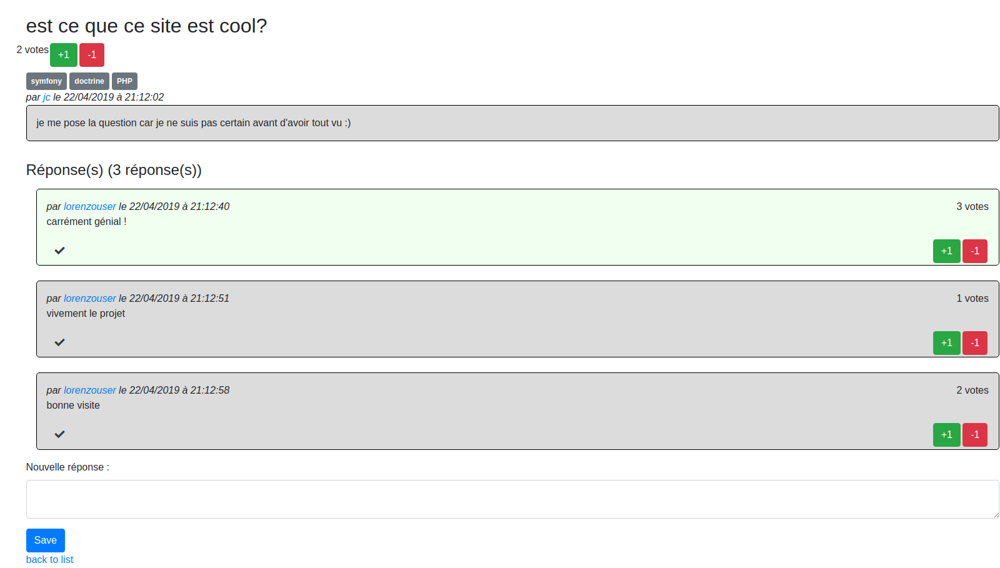

# FAQ-O-Clock

## Instructions

5. N'oubliez pas de **fournir un export de votre base de données** (les données seules) OU **fournir des Fixtures** (mieux, mais pas prioritaire). **S'il y'a des users/mots de passe indiquez-les dans un README à l'intention du correcteur.**

==> **je ne me suis pas trop attardé sur les fixtures et notamment sur alice par peur de manquer de temps**
==> dans mes fixtures le pass par defaut a hasher est password, les roles sont ROLE_USER (par defaut), ROLE_MODERATEUR et ROLE_ADMIN

- [trello](https://trello.com/b/EgH85MAz/eval-symfo)
- [docs GoogleDrive](https://docs.google.com/spreadsheets/d/1fyOXBYqU4ayFhr-0dm_giotal3Fif9QZeW2ldxRjI_Y/edit#gid=0)

==> les docs ne sont pas à jour (mcd compris) je n'ai pas eu le temps 

## Structure du site

### Fonctions de modération

- Sur la liste des questions (page Accueil) et sur la page des Questions/Réponses, **un bouton permet aux modérateurs de bloquer ou débloquer facilement une question ou une réponse**. Quand elle est bloquée, celle-ci ne s'affiche plus (ni depuis les listes, ni en accès direct), **BONUS : sauf pour les modérateurs et les admins**.

==> **je n'ai pas ajouté le bouton partout car je ne trouve pas logique de bloquer une question sans en voir le contenu (je ne liste que les titres des questions et pas le contenu pouvant être long comme sur stackoverflow) donc cela est disponible uniquement sur la page de la question**

TODO: **il me reste à ne pas afficher les questions et réponses bloquées dans les profils, je n'ai pas eu le temps**

### Tags

- **page Question/Tag** : consulter les questions associées à ce tag (accessible également depuis un nuage de tags sur la page d'accueil ou dans une sidebar). Afficher le tag sélectionné en haut de page.

==> **je n'ai pas de sidebar ou de nuage de tags car j'avais un lien dans la sidebar (comme stackoverflow)**

## BONUS

#### Ajouter un système de vote

- Sur la page de liste des questions (Accueil et Question/Tag), **les utilisateurs connectés peuvent voter "+1" pour une question**.

==> **même raison que pour le blocage on ne vote pas à une question sans en voir le contenu**

- Sur la page d'une question, **les utilisateurs connectés peuvent voter "+1" pour une réponse**.
- **Afficher alors les questions** (page Accueil et Question/Tag) **et les réponses** d'une question (page Question) **par nombre de votes décroissant**.

==> **je n'ai pas fait le tri car cela n'est pas pertinent, les plus vieille réponses seront mises en avant mais pas les récentes pouvant être aussi intéressante voire plus d'actualité (la technologie ca évolue)**

#### Réaliser au moins l'une des opérations suivante en AJAX

- Voter "+1",
- Valider une réponse,
- Bloquer/débloquer une question ou une réponse.

==> **j'ai tout fait sans js pour m'entrainer sur la nouveauté vue en spé et je n'ai pas eu le temps car j'ai perdu 2 jours à cause de problèmes vscode ou de vm**

TODO: faire les 3 en ajax
